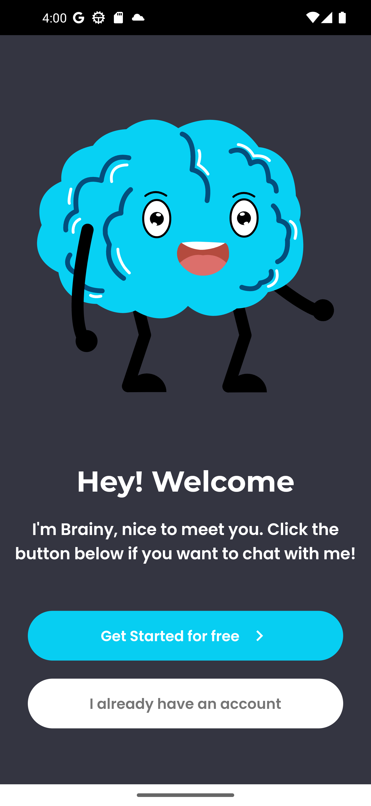
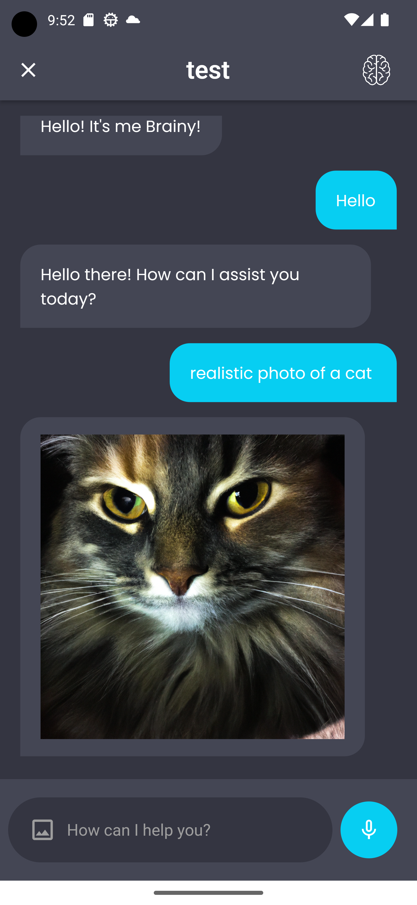
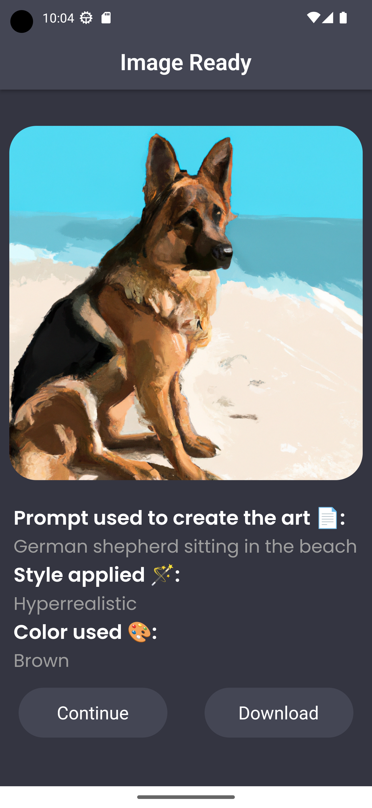

# 🧠 Brainy App

> Introducing *Brainy*, the innovative app powered by GPT-4 for intelligent Chatbot conversations and DALL-E 2 for stunning Image Generation.

## 📸 ScreenShots

   

   

## 📄 Description
Brainy is an innovative application that seamlessly integrates two powerful features:

- **Chatbot using GPT-4:**
  Brainy harnesses the advanced GPT-4 model through the OpenAI API to provide an interactive and intelligent chatbot experience. Engage in natural and dynamic conversations with Brainy.

- **Image Generation:**
  Alongside its exceptional chatbot capabilities, Brainy incorporates an image generator that taps into the OpenAI API. Generate stunning and diverse images based on various inputs, adding an artistic touch to your interactions.

## ⚙️ Features
- Chatbot using GPT-4:
  - Utilizes GPT-4 model through OpenAI API to provide conversational capabilities.
- Image Generation:
  - Utilizes OpenAI API to generate images based on given inputs.

## ✉️ Contact
For any inquiries or support, please contact us at brainycontactmail@gmail.com.
