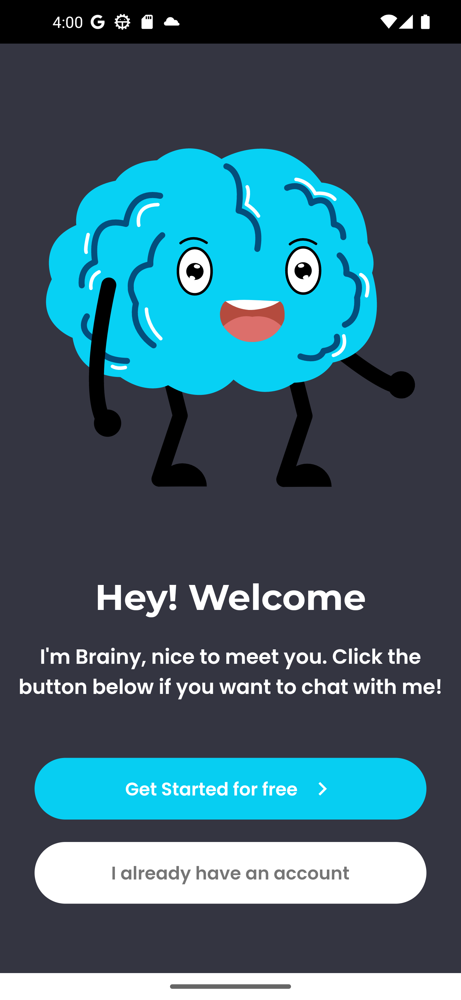
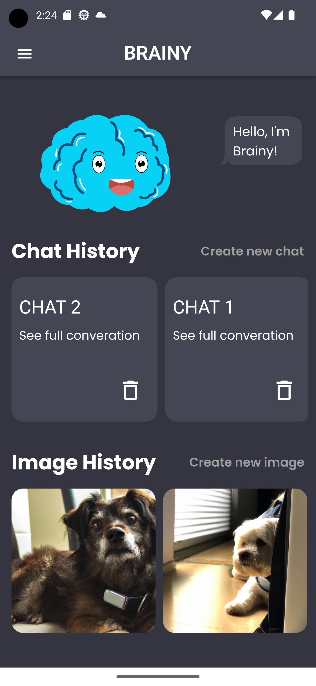
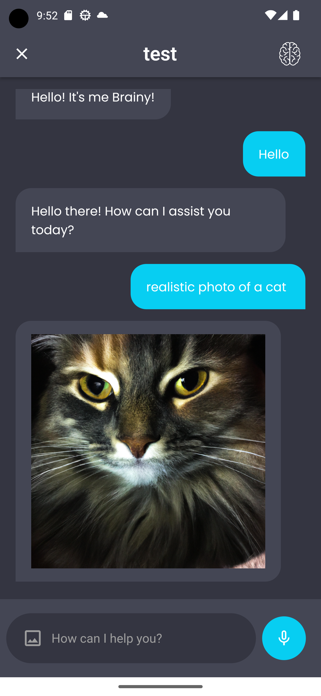
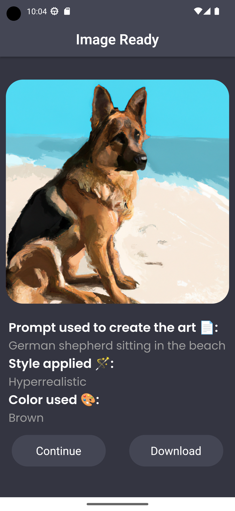

<a name="readme-top"></a>

<!-- -->

<br />
<div align="center">
  <a href="https://github.com/yagoquesada/brainy">
    
  </a>

<h1 align="center"> Brainy App </h1>

<p align="center"> Introducing <b>Brainy</b>, the innovative app powered by GPT-4 for intelligent Chatbot conversations and DALL-E 2 for stunning Image Generation.
    <br/>
    <a href="https://github.com/yagoquesada/brainy"><strong>Explore the docs »</strong></a>
    <br/>
    <br/>
    <a href="https://github.com/yagoquesada/brainy/blob/main/demo/Demo%20Brainy.mp4">View Demo</a>
    ·
    <a href="https://github.com/yagoquesada/brainy/issues">Report Bug</a>
    ·
    <a href="https://github.com/yagoquesada/brainy/issues">Request Feature</a>
  </p>
</div>

<!-- TABLE OF CONTENTS -->
<details>
  <summary>Table of Contents</summary>
  <ol>
    <li>
      <a href="#about-the-project">About The Project</a>
      <ul>
        <li><a href="#📄-description">Description</a></li>
        <li><a href="#🛠️-built-with">Built With</a></li>
        <li><a href="#📸-screenshots">Screenshots</a></li>
      </ul>
    </li>
    <li>
      <a href="#✅-getting-started">Getting Started</a>
      <ul>
        <li><a href="#prerequisites">Prerequisites</a></li>
        <li><a href="#installation">Installation</a></li>
      </ul>
    </li>
    <li><a href="#🙌-usage">Usage</a></li>
    <li><a href="#⚙️-features">Features</a></li>
    <li><a href="#🤝-contributing">Contributing</a></li>
    <li><a href="#✉️-contact">Contact</a></li>
  </ol>
</details>


## About The Project

### 📄 Description
Brainy is an innovative application that seamlessly integrates two powerful features:

- **Chatbot using GPT-4:**
  Brainy harnesses the advanced GPT-4 model through the OpenAI API to provide an interactive and intelligent chatbot experience. Engage in natural and dynamic conversations with Brainy.

- **Image Generation:**
  Alongside its exceptional chatbot capabilities, Brainy incorporates an image generator that taps into the OpenAI API. Generate stunning and diverse images based on various inputs, adding an artistic touch to your interactions.

<p align="right">(<a href="#readme-top">back to top</a>)</p>

### 🛠️ Built With

* [![Flutter][Flutter-img]][Flutter-url]
* [![Dart][Dart-img]][Dart-url]


<p align="right">(<a href="#readme-top">back to top</a>)</p>

### 📸 Screenshots
<p align="center">
   
</p>

<p align="center">
   
</p>

<p align="right">(<a href="#readme-top">back to top</a>)</p>


## ✅ Getting Started 

To get a local copy up and running follow these simple example steps.

### Prerequisites

Software that users need to have installed before they can use your project.

- Flutter: [Installation Guide](https://flutter.dev/docs/get-started/install)

### Installation

1. Clone the repository:
   ```bash
   git clone https://github.com/yagoquesada/brainy.git
2. Change to the project directory
   ```bash
   cd your-project
3. Install dependencies
   ```bash
   flutter pub get
   ```

<p align="right">(<a href="#readme-top">back to top</a>)</p>
   
## 🙌 Usage

Create a .env file in the project directory. Inside paste the following code:

  ```bash
  OPENAI_API_KEY = YOUR_API_KEY
  OPENAI_BASE_URL = https://api.openai.com/v1
  OPENAI_MODEL = gpt-4
  ```

> [!IMPORTANT]
> Change *YOUR_API_KEY* for your own OpenAI API key. Follow the instructions below to get your key and understand how to work with the OpenAI API.
> 
> [Quickstart Tutorial - OpenAI API](https://platform.openai.com/docs/quickstart?context=python)

> [!WARNING]
> OpenAI has different tiers, as your usage of the OpenAI API and your spend on the API goes up, they automatically graduate you to the next usage tier. So depending on the tier you might have errors when reaching the rate limit. For more information about rate limits and OpenAI tiers, read the following documentation:
> 
> [Rate limits - OpenAI API](https://platform.openai.com/docs/guides/rate-limits)  

Then you are ready to run it!
  ```bash
  flutter run
  ```

## ⚙️ Features
- Chatbot using GPT-4:
  - Utilizes GPT-4 model through OpenAI API to provide conversational capabilities.
- Image Generation:
  - Utilizes OpenAI API to generate images based on given inputs.

## 🤝 Contributing

Contributions are what make the open source community such an amazing place to learn, inspire, and create. Any contributions you make are **greatly appreciated**.

If you have a suggestion that would make this better, please fork the repo and create a pull request. You can also simply open an issue with the tag "enhancement".
Don't forget to give the project a star! Thanks again!

1. Fork the Project
2. Create your Feature Branch (`git checkout -b feature/AmazingFeature`)
3. Commit your Changes (`git commit -m 'Add some AmazingFeature'`)
4. Push to the Branch (`git push origin feature/AmazingFeature`)
5. Open a Pull Request

<p align="right">(<a href="#readme-top">back to top</a>)</p>

## ✉️ Contact
For any inquiries or support, please contact us at brainycontactmail@gmail.com.

Your Name - [@instagram](https://www.instagram.com/yagoquesada/) - yagoquesada2001@gmail.com

Project Link: [https://github.com/yagoquesada/brainy](https://github.com/yagoquesada/brainy)

<p align="right">(<a href="#readme-top">back to top</a>)</p>

<!-- MARKDOWN LINKS & IMAGES -->
[Flutter-img]: https://img.shields.io/badge/Flutter-%2302569B.svg?style=for-the-badge&logo=Flutter&logoColor=white
[Flutter-url]: https://flutter.dev/
[Dart-img]: https://img.shields.io/badge/dart-%230175C2.svg?style=for-the-badge&logo=dart&logoColor=white
[Dart-url]: https://dart.dev/
